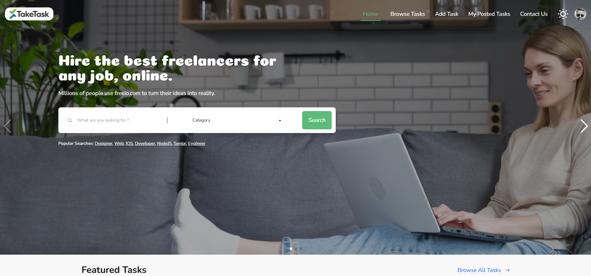

# 🧑‍💻 TakeTask – Freelance Task Marketplace

A modern freelance task platform where clients post tasks and freelancers browse, apply, and manage projects — connecting talent with opportunities in a streamlined way.

🔎 Project Overview
TakeTask Marketplace allows clients to create freelance task listings and freelancers to apply and manage their ongoing tasks. It features a secure authentication system, dynamic filtering for finding tasks, and a responsive interface for smooth interactions across devices.

🖼 Screenshot

---
## 🚀 Live Demo

[🌐 Live Website](https://take-task-marketplace-77c6d4.netlify.app/)

## ✨ Core Features

- 👤 User Authentication (Email/Password, Google, GitHub)
- 📝 Post Tasks with Categories, Budget, and Deadlines
- 🔍 Browse and Filter Tasks
- 🛠 Bid on Tasks
- 💼 View My Posted Tasks
- 💬 Task Details View
- 📦 Membership Plans UI
- 🎨 Responsive, modern design using TailwindCSS and DaisyUI

---

## 🛠 Tech Stack

**Client:**
- React
- React Router
- TailwindCSS + DaisyUI
- React Icons
- Firebase Auth
- React Toastify
- React sweet Alert2
- React Datepicker
- React Tooltip
- Swiper Slider
- React Icons

**Backend / API:**
- Node.js (Express)
- MongoDB (MongoDB Atlas)

📬 Contact
Reach me at: hosenrabby.dev@gmail.com

